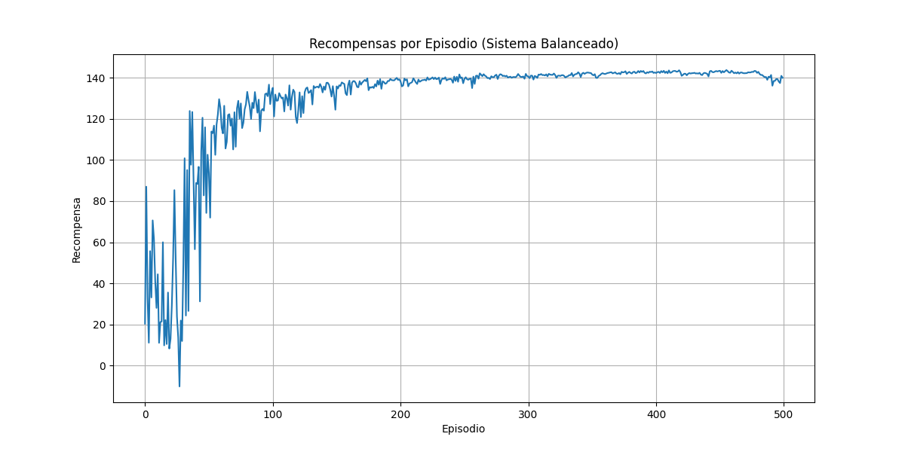
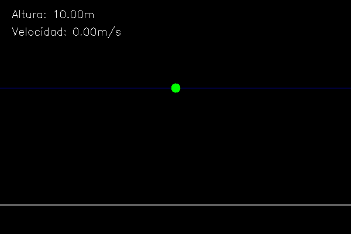

# Autonomous Drone Control System Using Reinforcement Learning

## Objective:
Train an AI agent to autonomously stabilize a virtual drone at a target altitude (10 meters) by learning to adjust engine thrust to counteract gravity and disturbances, using only reward signal feedback.

## Key Features:
- Custom physics simulation with adjustable gravity and thrust parameters
- Balanced reward system that strongly penalizes crashes and deviations
- Visual learning progression through graphs and animations

## Technical Implementation:
- **Language:** Python 3
- **Core Libraries:**
  - `gym`: Creates the custom drone simulation environment
  - `tensorflow/keras`: Implements the Deep Q-Network (DQN) with dense layers
  - `numpy`: Efficient state and reward vector operations
  - `matplotlib`: Training progress visualization
  - `opencv-python` + `imageio`: Animated simulation GIF generation

## Core Mechanics:
1. Drone receives observations (position, velocity vectors)
2. Selects from 3 actions:
   - Increase thrust
   - Decrease thrust
   - Maintain current thrust
3. Receives rewards for:
   - Maintaining target altitude proximity
   - Avoiding crashes (heavy penalties)
   - Smooth maneuvers (velocity-based penalties)

## Outputs Generated:
- Trained model in HDF5 format (`.h5`)

- Reward progression graph

- Demonstration GIF showing learned behavior

